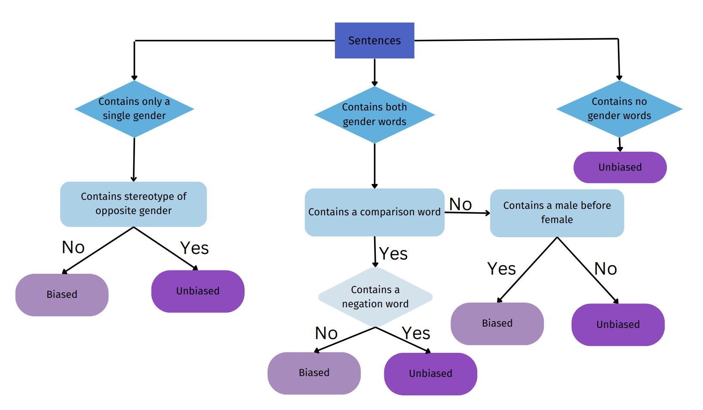

# Open-IIT-Data-Analytics
<html>
  <head>
  </head>
  <body>
    

<ul>
  <li>
<strong>Subordination model:</strong> 4 separate lists were made out of the given data, namely male list, female list, comparison list and a negation list. The male and female lists consist of a set of words to address the respective gender in different forms. The comparison list consists of a list of words that compares two entities. The negation list contains a set of words that negate a sentence. For every sentence that contains words from both male and female lists, we check that for comparison words. If it exists, then we also check for negation words. If the negation word exists, it is marked as unbiased, else it is marked as biased.</li>

<li><strong>Firstness model:</strong> We create 2 sets of words, one depicting male and another depicting female gender. Using these sets, if a sentence contains male words before female words, or words depicting only a single gender, we classify the statement as a biased one. Rest of the statements are considered to be unbiased. </li>

<li><strong>Stereotype model:<strong> In this model, we deal with biases based on certain fixed general characteristics associated with words that we as humans learn throughout our lifetime. For each statement, we tried to get the context of the sentence by observing if the words in the sentence are masculine or feminine and we also observed if the subject is male or female. If both the context and the subject are of the same gender, it shows stereotype and is labeled as biased. Otherwise the statement is anti-stereotypical and is labeled as unbiased.</li>
  
  </body>
  </html>
